# Architecture Overview

This document provides a comprehensive overview of the .NET 9 Aspire Fullstack Starter architecture.

## 🏗️ High-Level Architecture

The project follows a modern **Clean Architecture** pattern with Aspire orchestration. The Aspire Dashboard manages all services and provides monitoring, while the application consists of core services for API, Frontend, Database, and automated migrations.

```mermaid
graph TB
    subgraph "Aspire Dashboard"
        AD[🎛️ Orchestration & Monitoring]
    end
    
    subgraph "Application Services"
        API[🔧 API<br/>ASP.NET Core]
        FE[🌐 Frontend<br/>Blazor WASM]
        DB[(🗄️ MySQL<br/>Database)]
        MIG[⚡ Migrations<br/>Auto-Execute]
    end
    
    subgraph "External Services"
        DG[🔍 DbGate<br/>DB Admin]
        SC[📊 Scalar<br/>API Docs]
    end
    
    AD --> API
    AD --> FE
    AD --> DB
    AD --> MIG
    AD --> DG
    AD --> SC
    
    FE -.->|HTTPS + Cookies| API
    API -.->|Entity Framework| DB
    MIG -.->|Schema Updates| DB
    DG -.->|Admin Queries| DB
    
    classDef aspire fill:#e1f5fe
    classDef app fill:#f3e5f5
    classDef external fill:#e8f5e8
    
    class AD aspire
    class API,FE,DB,MIG app
    class DG,SC external
```

### Key Architecture Components

- **AppHost**: Aspire orchestration host managing all services and dependencies
- **API**: ASP.NET Core Minimal API with Entity Framework Core and ASP.NET Core Identity
- **Frontend**: Blazor WebAssembly client with MudBlazor components and cookie authentication
- **Database**: MySQL with automatic migrations and seeding via dedicated migration project
- **External Tools**: DbGate for database administration and Scalar for API documentation

## 🔄 Authentication & Data Flow

The application uses cookie-based authentication with a clear data flow pattern. Understanding this flow is crucial for development and debugging.

```mermaid
sequenceDiagram
    participant User as 👤 User
    participant Frontend as 🎨 Blazor WASM
    participant API as 🚀 ASP.NET Core API
    participant DB as 🗄️ MySQL Database
    
    Note over User, DB: Login Flow
    User->>Frontend: Enter credentials
    Frontend->>API: POST /api/login?useCookies=true
    API->>DB: Validate credentials
    DB-->>API: User data
    API-->>Frontend: 200 OK + Auth Cookie
    Frontend->>Frontend: Store UserInfo in localStorage
    
    Note over User, DB: Authenticated Requests
    User->>Frontend: Trigger action
    Frontend->>API: Request + Auth Cookie
    API->>DB: Business logic & data
    DB-->>API: Results
    API-->>Frontend: JSON response
    Frontend-->>User: Updated UI
    
    Note over User, DB: Session Management
    Frontend->>API: GET /api/manage/user (periodic)
    API-->>Frontend: Refresh session + user info
```

### Authentication Details

- **Cookie Authentication**: Uses `IdentityConstants.ApplicationScheme` with 30-minute sliding expiration
- **Frontend State**: `CookieAuthenticationStateProvider` with localStorage persistence
- **Session Refresh**: Automatic session extension via `/api/manage/user` endpoint
- **Security**: HTTPS enforcement, secure cookies, and anti-forgery protection

## 🏛️ Clean Architecture Implementation

The project implements Clean Architecture principles with clear separation of concerns and dependency inversion.

### Layer Responsibilities

- **Domain Layer** (`src/Api/Domain/`): Core business entities, value objects, and business rules with no external dependencies
- **Data Layer** (`src/Api/Data/`): Entity Framework DbContext, database configurations, and data access patterns
- **API Layer** (`src/Api/`): HTTP endpoints, request/response models, and authentication/authorization
- **Presentation Layer** (`src/Frontend/`): Blazor components, user interface logic, and client-side state management

### Key Architectural Patterns

- **Repository Pattern**: Implemented via Entity Framework Core DbContext
- **Dependency Injection**: Built-in .NET DI container with Aspire service registration
- **Configuration Pattern**: Aspire Service Defaults for shared configuration
- **Clean Code Principles**: SOLID principles applied throughout the codebase

## 🔌 Service Communication & Integration

### Aspire Service Discovery

- **Automatic Registration**: All services automatically registered with Aspire
- **Health Monitoring**: Built-in health checks for all dependencies
- **Configuration Management**: Centralized configuration via `ServiceDefaults`
- **Development Tools**: DbGate and Scalar automatically configured and accessible

### Communication Patterns

- **Frontend ↔ API**: HTTPS with cookie authentication and CORS support
- **API ↔ Database**: Entity Framework Core with connection pooling
- **Migrations**: Automatic execution during startup via dedicated migration project
- **Monitoring**: Real-time service status via Aspire Dashboard

## 🛡️ Security Architecture

### Authentication & Authorization

- **ASP.NET Core Identity**: Industry-standard user management with custom entities
- **Cookie Authentication**: Secure session management with sliding expiration
- **Authorization Policies**: Role-based and policy-based authorization ready for extension
- **Cross-Service Security**: Consistent authentication across API and Frontend

### Security Measures

- **HTTPS Enforcement**: All communication encrypted in production
- **Secure Cookies**: HttpOnly, Secure, and SameSite attributes
- **Anti-Forgery Protection**: CSRF protection for state-changing operations
- **Security Headers**: HSTS, CSP-ready, and other security headers configured

## 🔧 Development & Testing Architecture

### Development Experience

- **Hot Reload**: Blazor WebAssembly and API support instant updates
- **Automatic Migrations**: Database schema updates on startup
- **Integrated Tools**: DbGate for database management, Scalar for API testing
- **Service Orchestration**: Single command startup with `aspire run`

### Testing Strategy

- **Unit Testing**: Component and service isolation testing
- **Integration Testing**: API endpoint and database testing with Aspire fixture
- **Browser Testing**: End-to-end Playwright tests with MCP integration
- **Service Testing**: Aspire orchestration and service health validation

### Database Development

- **Code-First Approach**: Entity Framework migrations with automatic execution
- **Seeding Strategy**: Initial data population via dedicated seeding project
- **Development Database**: Containerized MySQL with persistent volumes
- **Migration Management**: Version-controlled schema changes with rollback support

## 🚀 Deployment & Scalability

### Container Architecture

- **Multi-Container Deployment**: Separate containers for API, Frontend, Database, and tools
- **Health Checks**: Container-level health monitoring and automatic restart
- **Environment Configuration**: Flexible configuration for development and production environments
- **Cloud-Ready**: Prepared for Kubernetes, Azure Container Apps, or AWS deployment

### Scalability Considerations

- **Stateless Design**: API designed for horizontal scaling across multiple instances
- **Database Connection Pooling**: Efficient resource utilization and connection management
- **Client-Side Rendering**: Blazor WebAssembly reduces server load
- **Performance Monitoring**: OpenTelemetry integration for distributed tracing and metrics

### Production Readiness

- **Configuration Management**: Environment-specific settings with secure secret management
- **Logging & Monitoring**: Structured logging with Aspire telemetry integration
- **Backup Strategy**: Database backup and recovery procedures ready for implementation
- **CI/CD Ready**: GitHub Actions workflows for automated testing and deployment
